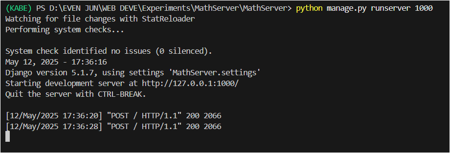
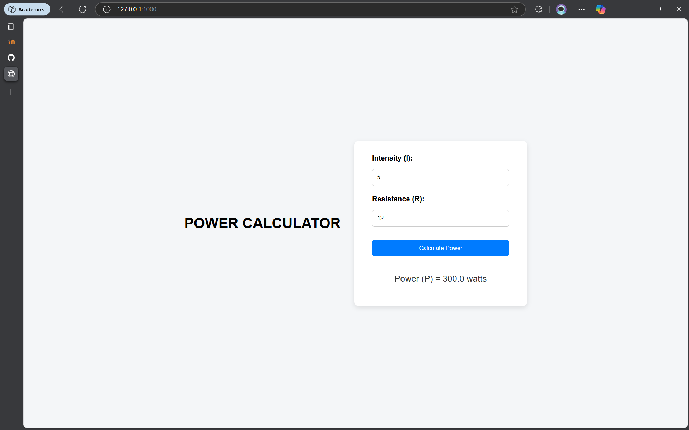

# Ex.05 Design a Website for Server Side Processing
## Date: 05 - 05 - 2025

## AIM:
 To design a website to calculate the power of a lamp filament in an incandescent bulb in the server side. 


## FORMULA:
P = I<sup>2</sup>R
<br> P --> Power (in watts)
<br> I --> Intensity
<br> R --> Resistance

## DESIGN STEPS:

### Step 1:
Clone the repository from GitHub.

### Step 2:
Create Django Admin project.

### Step 3:
Create a New App under the Django Admin project.

### Step 4:
Create python programs for views and urls to perform server side processing.

### Step 5:
Create a HTML file to implement form based input and output.

### Step 6:
Publish the website in the given URL.

## PROGRAM :

### 1. Settings Configuration
```python
# filepath: d:\EVEN JUN\WEB DEVE\Experiments\MathServer\MathServer\settings.py
INSTALLED_APPS = [
    'django.contrib.admin',
    'django.contrib.auth',
    'django.contrib.contenttypes',
    'django.contrib.sessions',
    'django.contrib.messages',
    'django.contrib.staticfiles',
    'MathApp',
]
```

### 2. Views Implementation
```python
# filepath: d:\EVEN JUN\WEB DEVE\Experiments\MathServer\MathApp\views.py
from django.shortcuts import render

def calculate_power(request):
    if request.method == 'POST':
        intensity = float(request.POST.get('intensity', 0))
        resistance = float(request.POST.get('resistance', 0))
        power = intensity * intensity * resistance
        return render(request, 'power_calculator.html', {
            'power': power,
            'intensity': intensity,
            'resistance': resistance
        })
    return render(request, 'power_calculator.html')
```

### 3. URL Configurations

Main URLs:
```python
# filepath: d:\EVEN JUN\WEB DEVE\Experiments\MathServer\MathServer\urls.py
from django.contrib import admin
from django.urls import path, include

urlpatterns = [
    path('admin/', admin.site.urls),
    path('', include('MathApp.urls')),
]
```

App URLs:
```python
# filepath: d:\EVEN JUN\WEB DEVE\Experiments\MathServer\MathApp\urls.py
from django.urls import path
from . import views

urlpatterns = [
    path('', views.calculate_power, name='calculate_power'),
]
```

### 4. HTML Template
```html
# filepath: d:\EVEN JUN\WEB DEVE\Experiments\MathServer\MathApp\templates\power_calculator.html
<!DOCTYPE html>
<html>
<head>
    <title>Power Calculator</title>
    <style>
        body {
            font-family: Arial, sans-serif;
            max-width: 600px;
            margin: 0 auto;
            padding: 20px;
        }
        .form-group {
            margin-bottom: 15px;
        }
        input[type="number"] {
            width: 200px;
            padding: 5px;
        }
        .result {
            margin-top: 20px;
            padding: 10px;
            background-color: #f0f0f0;
        }
    </style>
</head>
<body>
    <h1>Power Calculator for Lamp Filament</h1>
    <form method="post">
        
        <div class="form-group">
            <label>Intensity (I) in amperes:</label><br>
            <input type="number" name="intensity" step="0.01" required 
                   value="{{ intensity|default:'' }}">
        </div>
        <div class="form-group">
            <label>Resistance (R) in ohms:</label><br>
            <input type="number" name="resistance" step="0.01" required 
                   value="{{ resistance|default:'' }}">
        </div>
        <input type="submit" value="Calculate Power">
    </form>

    
    <div class="result">
        <h2>Result:</h2>
        <p>Power (P) = {{ power|floatformat:2 }} watts</p>
        <p>Formula: P = I² × R</p>
        <p>Where:</p>
        <ul>
            <li>I = {{ intensity|floatformat:2 }} amperes</li>
            <li>R = {{ resistance|floatformat:2 }} ohms</li>
        </ul>
    </div>
    
</body>
</html>
```


## SERVER SIDE PROCESSING:

## HOMEPAGE:


## RESULT:
The program for performing server side processing is completed successfully.
